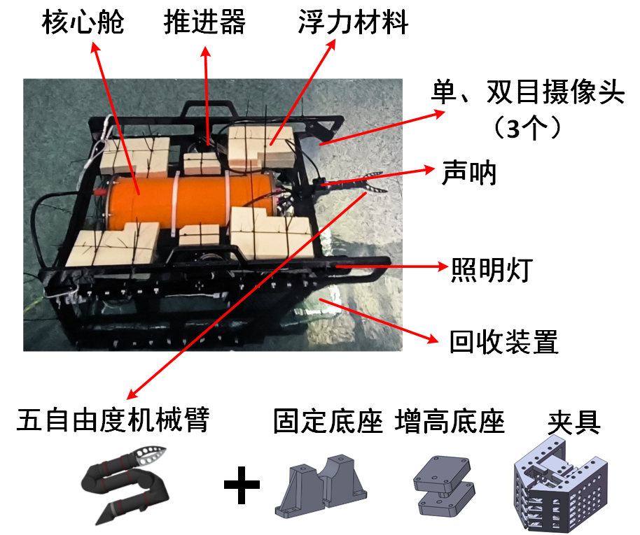
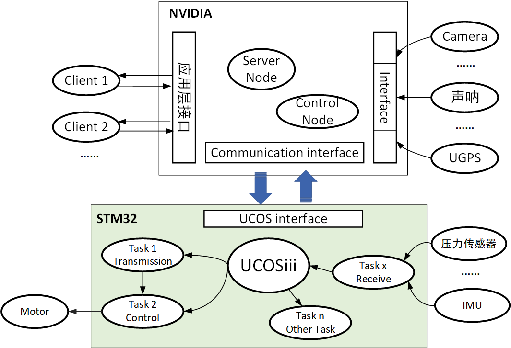
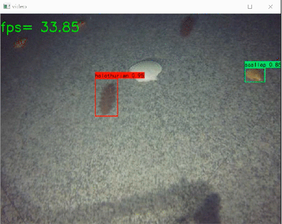
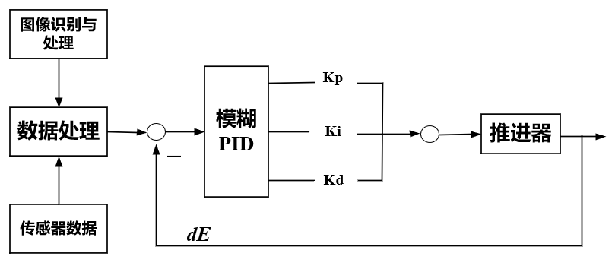

# Underwater Robot Design

**参考视频链接：** https://www.bilibili.com/video/BV1mj41147Ke/?spm_id_from=333.999.0.0&vd_source=4be7561bc287d34ebce9f64909e36931

**项目描述：** 该项目针对水下机器人的应用进行软硬件的设计与开发。

主要包括：硬件框架、软件框架和应用开发。 

个人工作：个人完全负责该型机器人软件框架的设计与开发，同时负责问题排查定位与调试。

- 控制算法：编写双闭环PID控制算法；在NVIDIA上部署深度强化学习DDPG算法（Pytorch框架）。

- RTOS 开发：在 STM32F103 应用 UCOSIII，提高了多任务实时性，解决中断丢失等问题。

- 数据交互：上位机通信框架采用类 C/S 模型设计，以实现多端交互。具体建立了基于 TCP/IP 远程通信；IPC 进程间通信；另外，封装串口和摄像头设备接口，以共享资源。

- 图像处理/识别：OpenCV 图像去噪，部署 Yolov4-tiny 模型训练与检测，Fps 达 20+，反馈控制。

- 人机交互：采用 PyQT5 界面+Socket+多线程等技术编写上位机软件，实现算法参数调试、传感器数据显示和视频图像回传，同时编写游戏手柄遥操作机器人程序。

以下仅作展示，**本项目暂时不开源。**

---

## 水下机器人成品展示

- 机器人本体：密封耐压仓、回收装置、浮力材料、外部传感器

- 检测装置：IMU、前向声呐、摄像头、压力检测、漏水检测

- 控制器：NVIDIA Jetson xavier NX、STM32F103

- 执行机构：直流电机（6推进器）、五自由度机械臂

## 封装测试流程

- 框架组装。

- 线路布置。控制器布放和固定、外部传感器电路连接，电源模块连接等。

- 功能测试。模块化测试，确保压力、通信、传感器、电机驱动等正常运行。

- 防水灌封。环氧树脂灌封和水密接插件设计，保障舱体防水性能。

- 密封测试。通过测量气密性完成验证。

- 封舱测试。再次进行功能验证和气密性验证。

- 水下测试。在真实水下环境中，测试舱体防水性能、各模块水下工作状况。完成测试。

任何一个步骤没完成，则再次回退到上一个步骤进行检测。

## 系统软件框架设计

    软件框架实现 网络数据通信、数据交互传输、传感器驱动、工作状态检测和上位机调试。在该框架基础上，将不同的任务合理划分到不同的处理单元上，实现整体性能的提升。

- NVIDIA系列板卡作为机载电脑，处理复杂的任务，如图像识别，运动规划等。
- STM32作为底层控制器，搭载ucosiii，方便应用开发，提高多任务的实时性。

## 应用开发

### 上位机人机交互界面

主要功能：

- 视频传输

- 数据监控

- 急停开关

- 消息显示

- 在线参数调试

- 手柄遥操作控制

- 机械臂遥操作控制

### 基于yolov4-tiny模型训练的海产品识别

目的：采用单目摄像头+声呐进行目标探测。

步骤：1. 收集海参、扇贝的图像进行标注，制作数据集，采用yolov4模型进行训练。

2. 基于训练模型，提取像素坐标，进行相应坐标转换，用于后续视觉反馈控制。

以下是海参和扇贝的识别效果图。识别准确度较高，fps可达到33。

以下是基于视觉反馈控制的自主抓取过程的动态图。

视觉控制算法采用模糊PID的方式，处理视觉反馈提取的数据，同时结合声呐、压力等传感器数据完成反馈。

### 基于ROS机械臂遥操作

以下是通过ROS框架，完成的机械臂手动遥操作控制。

 

## 实战

该机器人在水池、湖泊和海洋环境中进行了测试，实际效果良好，防水、控制等性能良好。

**在2022参与全国水下机器人大赛并获奖**。

